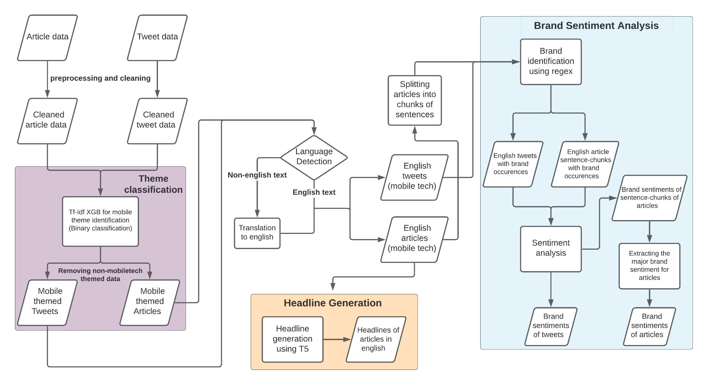
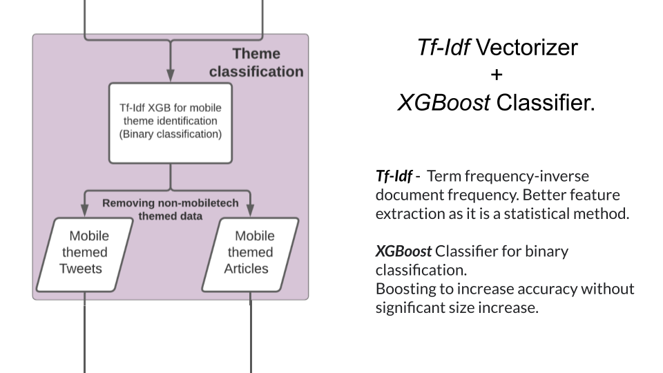
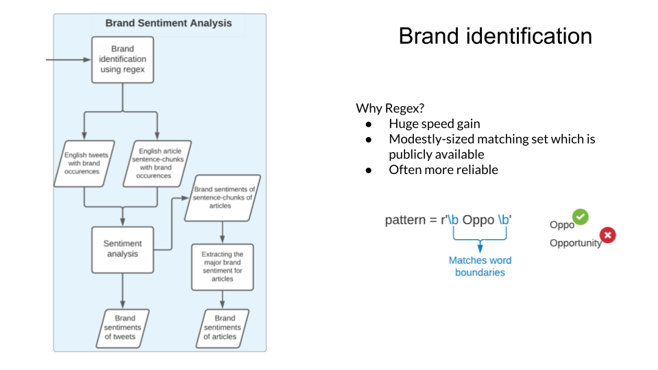
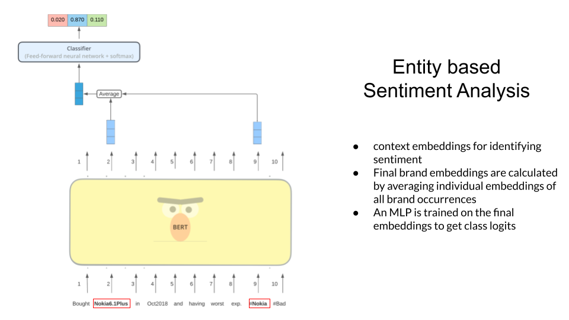
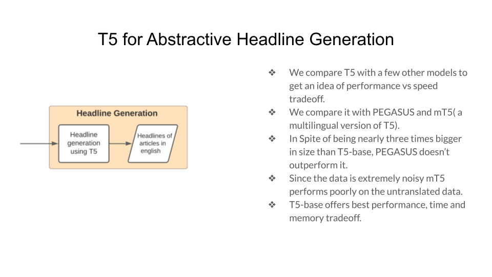

## BRIDGEi2i's Automatic Headline And Sentiment Generator

This Repo Contains the code and presentation of IIT (BHU) Varanasi Team for the [event](bridgei2i-PS.pdf) BRIDGEi2i's Automatic Headline And Sentiment Generator at Inter IIT Tech Meet '21. Our Team secured a **Silver Medal** at the event.  

### Salient Features

We briefly explain the salient features of our approach here. In [#Approach](#approach), we explain each task in detail.  

#### 1) Simpler and faster models for binary classification

- Binary classification for mobile-theme identification is not a very difficult task.
- The amount of data being processed in this step is about 4 times that being processed in the other steps. This is because the ratio of mobile-themed to non-mobile themed data is about 1:3, and we only need to do the other tasks on mobile-themed data. 
- Therefore it makes sense to use simpler and faster models for this step.

#### 2) Translation of all data to english for headline generation and sentiment analysis

- Headline generation is a difficult task, which yielded poor results on multilingual data.
- Translating all data to English language using an accurate model not only provides greater scope for scalability to additional languages, it even improves performance on other tasks for which we may already have superior pretrained models in English.

#### 3) Regex matching for brand identification

- The set of all possible mobile brands is a modestly-sized set
- Using regex matching instead of framing it as an NER problem is much faster and often more reliable.

#### 4) Using advanced models like T5 for headline generation

- We tried a lot of possible variants but T5 performed the best.

### Complete Pipeline

 
 

### Approach

 
 

### **Team**

<table>
   <td align="center">
      <a href="https://github.com/arch-raven">
        
          
         
            <b>Aditya Kumar</b>
         
      </a>
       
   </td>
   <td align="center">
      <a href="https://github.com/ankitdipto">
         
          
         
            <b>Ankit</b>
         
      </a>
       
   </td>
   <td align="center">
      <a href="https://github.com/P-Kshitij">
         
          
         
            <b>Kshitij Parvani</b>
         
      </a>
       
   </td>
   <td align="center">
      <a href="https://github.com/Noct068">
         
          
         
            <b>Lakshya Rathore</b>
         
      </a>
       
   </td>
   <td align="center">
      <a href="https://github.com/pranavajitnair">
         
          
         
            <b>Pranav Ajit Nair</b>
         
      </a>
       
   </td>
   <td align="center">
      <a href="https://github.com/Satyam-kumar-yadav">
         
          
         
            <b>Satyam kumar yadav</b>
         
      </a>
       
   </td>
   <td align="center">
      <a href="https://github.com/theAssassin28">
         
          
         
            <b>Shivam Singh</b>
      </a>
       
   </td>
</table>
